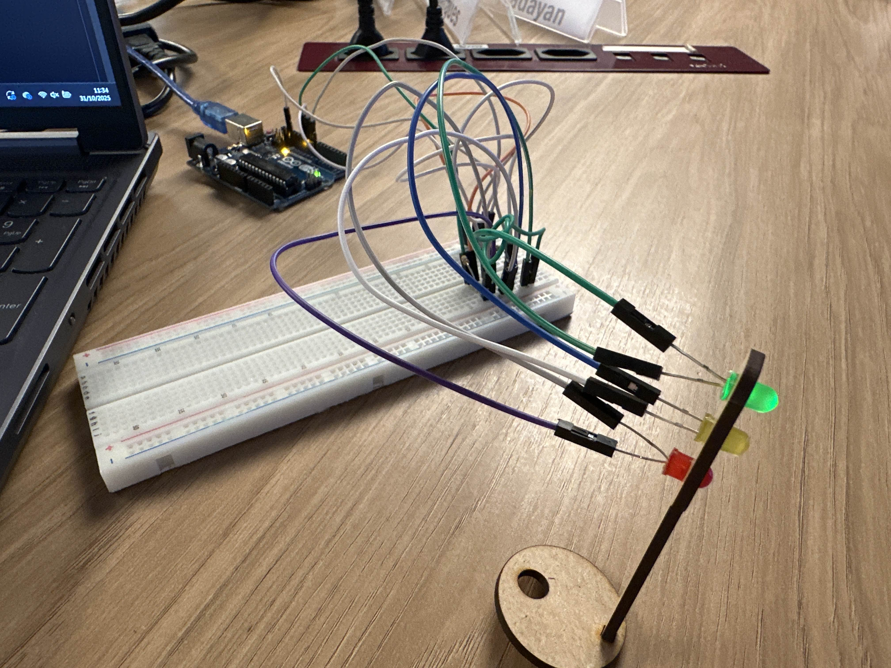

# Projeto: Semáforo com Arduino (POO)

Este projeto implementa um semáforo simples de três luzes (vermelho, amarelo, verde) utilizando um Arduino. A lógica de programação foi feita usando Programação Orientada a Objetos (POO).

## 1. Descrição

O objetivo é controlar um semáforo, alternando as luzes de acordo com uma temporização pré-definida. O código utiliza uma classe chamada `Semaforo` para encapsular toda a funcionalidade, e um ponteiro é usado no arquivo principal (`.ino`) para instanciar e gerenciar o objeto.

## 2. Componentes Necessários

* 1x Placa Arduino (UNO ou compatível)
* 1x Protoboard
* 1x Base LED
* 1x LED Vermelho
* 1x LED Amarelo
* 1x LED Verde
* 3x Resistores de 220Ω (ou 330Ω)
* Jumpers (fios de conexão)

## 3. Montagem (Conexões)

As conexões de hardware devem seguir o esquema abaixo, conforme definido nas constantes do código:

* **`PINO_LED_VERMELHO` (Porta 10):** Conectar o ânodo (pino longo) do LED vermelho a esta porta, através de um resistor.
* **`PINO_LED_AMARELO` (Porta 9):** Conectar o ânodo (pino longo) do LED amarelo a esta porta, através de um resistor.
* **`PINO_LED_VERDE` (Porta 8):** Conectar o ânodo (pino longo) do LED verde a esta porta, através de um resistor.
* **`GND`:** Conectar o cátodo (pino curto) de **todos** os LEDs ao pino `GND` do Arduino.

**Foto da Montagem:**



**Video da Montagem:**

https://drive.google.com/file/d/1zOojgailmrBes6hqWeGpYCYaP5gCXwJU/view?usp=sharing 

## 4. Lógica de Funcionamento

O programa executa um ciclo contínuo (`executarCiclo()`) que alterna entre os estados (luzes) do semáforo. A temporização de cada fase, definida na classe `Semaforo`, é:

1. **Vermelho:** Aceso por 6000 ms (6 segundos).
2. **Verde:** Aceso por 4000 ms (4 segundos).
3. **Amarelo:** Aceso por 2000 ms (2 segundos).

Após a luz amarela, o ciclo recomeça imediatamente com a luz vermelha.

## 5. Estrutura do Código

* **Classe `Semaforo`:** Contém todas as variáveis (pinos, tempos) e métodos (`vermelho`, `verde`, `amarelo`) para o funcionamento do semáforo.
* **`setup()`:** Função principal do Arduino que cria o objeto `Semaforo` (usando `new`) e chama `configurarPinos()` para definir os pinos como saídas.
* **`loop()`:** Função principal do Arduino que chama repetidamente `semaforo->executarCiclo()` para manter o semáforo em operação.

## 6. Código
```
class Semaforo {
public:
    Semaforo(int pinoVermelho, int pinoAmarelo, int pinoVerde) {
        _pinoVermelho = pinoVermelho;
        _pinoAmarelo = pinoAmarelo;
        _pinoVerde = pinoVerde;

        _tempoVermelho = 6000;
        _tempoVerde = 4000;
        _tempoAmarelo = 2000;
    }

    void configurarPinos() {
        pinMode(_pinoVermelho, OUTPUT);
        pinMode(_pinoAmarelo, OUTPUT);
        pinMode(_pinoVerde, OUTPUT);
    }

    void executarCiclo() {
        vermelho();
        verde();
        amarelo();
    }

private:
    int _pinoVermelho;
    int _pinoAmarelo;
    int _pinoVerde;

    unsigned long _tempoVermelho;
    unsigned long _tempoVerde;
    unsigned long _tempoAmarelo;

    void definirLuzes(int v, int a, int vd) {
        digitalWrite(_pinoVermelho, v);
        digitalWrite(_pinoAmarelo, a);
        digitalWrite(_pinoVerde, vd);
    }

    void vermelho() {
        definirLuzes(HIGH, LOW, LOW);
        delay(_tempoVermelho);
    }

    void verde() {
        definirLuzes(LOW, LOW, HIGH);
        delay(_tempoVerde);
    }

    void amarelo() {
        definirLuzes(LOW, HIGH, LOW);
        delay(_tempoAmarelo);
    }
};

const int PINO_LED_VERMELHO = 10;
const int PINO_LED_AMARELO = 9;
const int PINO_LED_VERDE = 8;

Semaforo* semaforo;

void setup() {
    semaforo = new Semaforo(PINO_LED_VERMELHO, PINO_LED_AMARELO, PINO_LED_VERDE);
    semaforo->configurarPinos();
}

void loop() {
    semaforo->executarCiclo();
}
```
